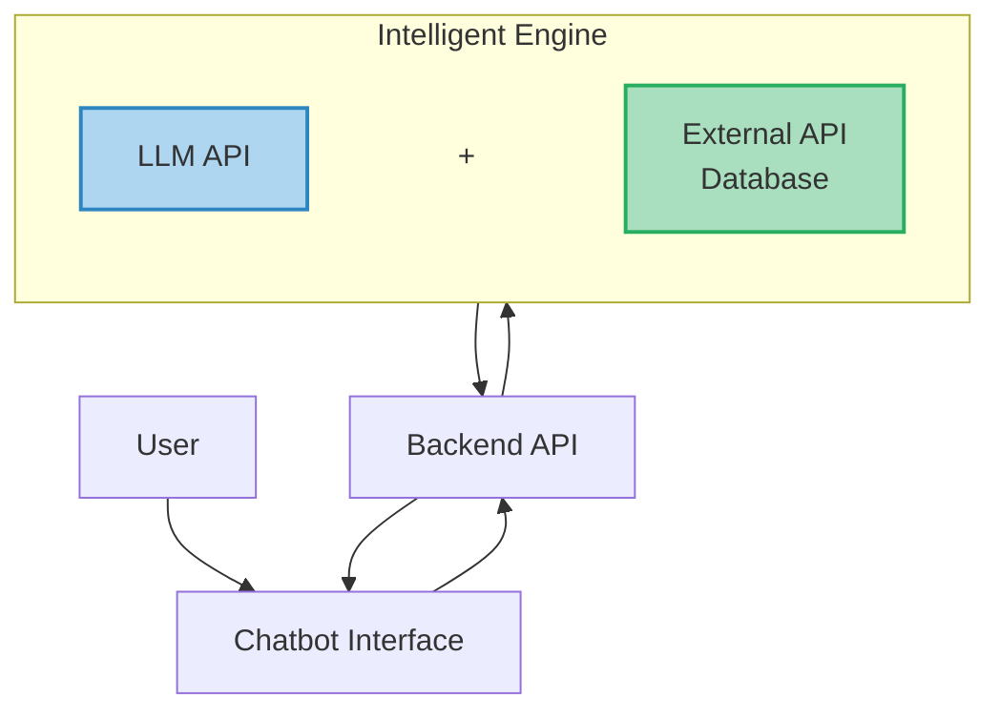
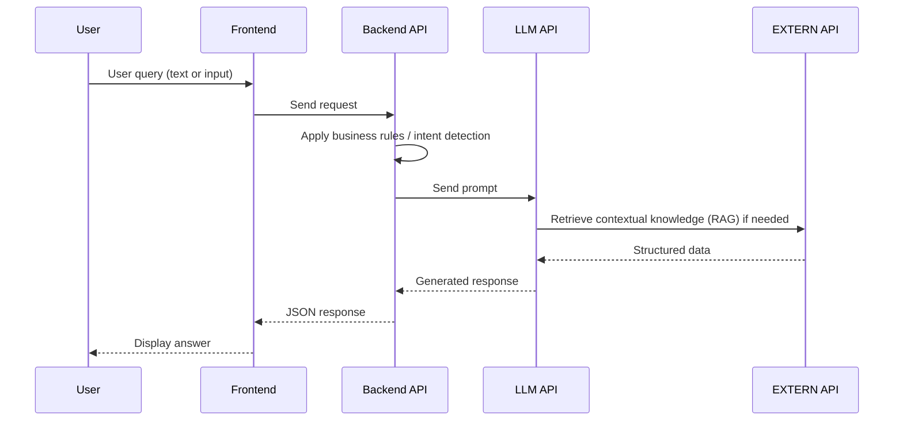
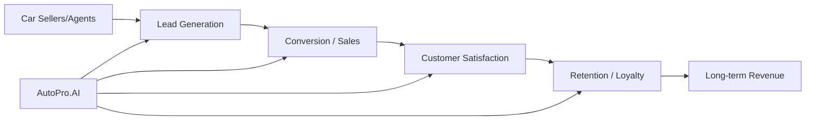
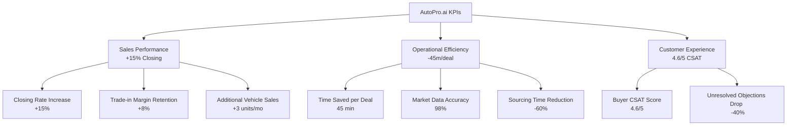
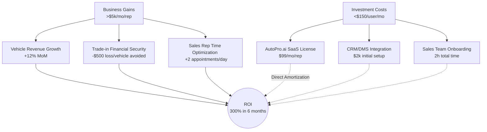
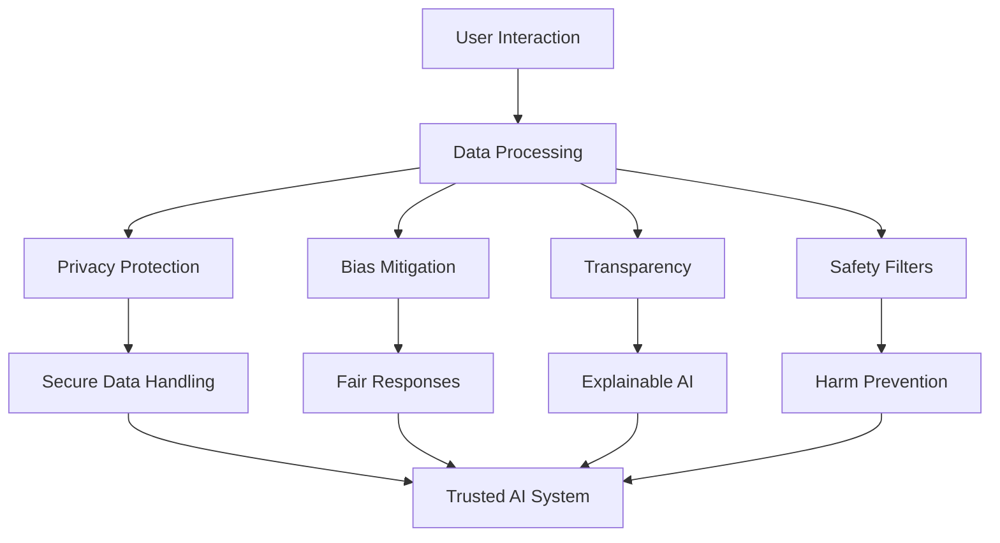

# Graphic Documentation – AutoPro.ai

## 1. System Overview

---

## 2. Intelligent Processing Pipeline (RAG + Decision Logic)

---

## 3. Business Value Chain Impact

---

## 4. KPI Framework

---

## 5. ROI Model

---

## 6. Ethical AI (Responsible Design)

---

# Linear Documentation – AutoPro.ai

## 1. Executive Summary
**AutoPro.ai** is a B2B SaaS Artificial Intelligence platform designed for automotive professionals (dealerships, brokers, and fleet managers). The engine transforms millions of technical and market data points into instant, high-impact sales arguments to accelerate the customer decision-making cycle.

---

## 2. Marketing Targets
We target three primary segments within the automotive ecosystem:

* **Primary Target: Car Dealership Groups**
    * *Profile:* New and used car sales representatives, sales managers.
    * *Need:* Increase the closing rate in the showroom and digital leads conversion.

* **Secondary Target: Automotive Brokers & Agencies**
    * *Profile:* Independent consultants or multi-brand procurement networks.
    * *Need:* Save time on technical sourcing and offer objective cross-brand advice.

* **Tertiary Target: Fleet Managers (B2B)**
    * *Profile:* Corporate fleet supervisors and financial controllers.
    * *Need:* Optimize tax impact (LOM law, TVS) and long-term TCO.

---

## 3. Needs & Pain Points
The market faces three major challenges that AutoPro.ai addresses:

1.  **Technical Complexity:** The shift to Electric (EV) and Hybrid vehicles makes it difficult for sales staff to master range, charging times, and battery health data.

2.  **Customer "Infobesity":** Modern buyers come prepared with contradictory online information. Sales reps need a "single source of truth" to regain authority.

3.  **Margin Pressure:** Overvaluing a trade-in (used car) due to unknown chronic mechanical issues is a major profit killer.

---

## 4. Strategic Goals
* **Product Goal:** Achieve **99% response accuracy** on technical and fiscal queries.

* **Operational Goal:** Reduce administrative and research time by **30% per client file**.

* **Market Goal:** Deploy the solution to **50 pilot dealerships** within the first 6 months.

---

## 5. Value Chain
How AutoPro.ai creates value at every stage:

1.  **Data Ingestion:** Continuous harvesting of technical specs, real-time market prices, manufacturer recalls, and 20 years of reliability history.

2.  **LLM Fine-tuning:** Processing raw data through a proprietary AI engine trained specifically on automotive sales semantics.

3.  **Delivery Interface:** A lightning-fast web interface (responses in **<3s**) optimized for mobile and tablet use in showrooms.

4.  **Sales Enablement:** Instant generation of "Decision Kits" (TCO comparisons, reliability reports) given to the customer to secure the deal.

---

## 6. KPIs (Key Performance Indicators)
We track success through the following operational metrics:

* **Time Efficiency:** Average time saved per sales rep (**Target: 45 min / deal**).

* **Data Precision:** Accuracy rate of technical and fiscal information (**Target: 98%**).

* **User Engagement:** Number of "TCO" or "Head-to-Head" queries per rep/day (**Target: >15**).

* **Client Satisfaction:** Buyer CSAT score following an AI-assisted presentation (**Target: 4.6/5**).

---

## 7. ROI Model (Return on Investment)
The financial justification for AutoPro.ai is built on three pillars:

* **Closing Rate Uplift:** A **+15% increase in sales** by handling technical objections instantly.

* **Trade-in Risk Mitigation:** Avoiding financial losses on used car buy-backs (Estimated **$500 saved per "at-risk" vehicle**).

* **Volume Increase:** Time saved allows each rep to handle **2 additional customer appointments per day**.

With a subscription cost of approximately 99 USD per representative, AutoPro.ai yields an estimated net profit exceeding $3,000 monthly, ensuring a 300% return on investment inside of half a year.